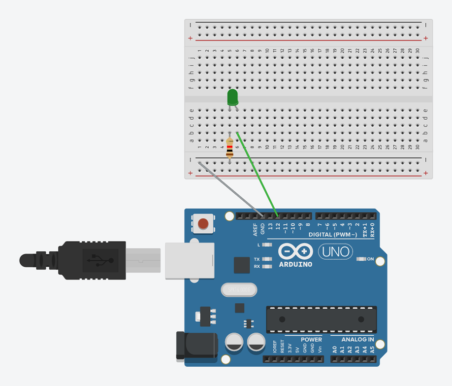

<h1 align="center">Semáforo de leds com arduino</h1>
 <h3>Para o projeto são necessários:</h3>

* 3 leds. Sendo um verde, um amarelo e um vermelho;
* 4 jumpers;
* 3 resistores.

<h3>Imagem do projeto:</h3>
